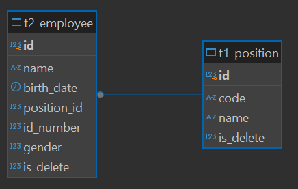

<p align="center">

<h3 align="center">Employee API</h3>
</p>
<p align="justify">
Employee API is a RESTful API application used for employee management. The available features include:
</p>
<ul>
    <li>Employee Management (CRUD)</li>
</ul>

### Built With

- [Springboot v3.5.3](https://spring.io/)
- [Java 17](https://www.oracle.com/java/technologies/javase/jdk17-archive-downloads.html)
- [PostgreSQL](https://www.postgresql.org/docs/)
- [Maven](https://maven.apache.org/)
- Liquibase

### Prerequisites

This is an example of how to list things you need to use the software and how to install them.

- Java IDEA
- PgAdmin or other PostgreSQL DBMS
- Postman or other API Testing Apps
- Maven Build Tools
- Spring Boot

### Installation

1. Clone the repo
   ```sh
    git clone https://github.com/Myudhaap/spring-employee-api
   ```
2. Rename application.properties.example to application.properties and change few config

   ```properties
    spring.application.name=SmartBook
    
    spring.datasource.username=YOUR_USERNAME_DATABASE
    spring.datasource.password=YOUR_PASSWORD_DATABASE
    spring.datasource.url=jdbc:postgresql://localhost:5433/YOUR_NAME_DATABASE
    spring.datasource.driver-class-name=org.postgresql.Driver
    spring.jpa.properties.hibernate.dialect=org.hibernate.dialect.PostgreSQLDialect
    
    spring.jpa.hibernate.ddl-auto=validate
    spring.jpa.properties.hibernate.format_sql=true
    spring.jpa.show-sql=true
    
    spring.liquibase.enabled=true
    spring.liquibase.change-log=classpath:db/changelog/db.changelog-master.yaml
    spring.liquibase.clear-checksums=true
    spring.profiles.active=default
   ```
3. Install all dependencies and run Maven reload

4. Then run the project on branch development

## API Documentation

Postman : https://documenter.getpostman.com/view/38733465/2sB2xFfTU4

### Example Request

- Endpoint : ```/api/v1/employees```
- Method : POST
- Header :
    - Content-Type: application/json
    - Accept: application/json
- Body :

```json
{
  "name": "Yogi Lestari",
  "birthDate": "1990-02-14",
  "position": {
    "id": 5,
    "code": "HELP",
    "name": "Helpdesk",
    "isDelete": 0
  },
  "idNumber": 14021990,
  "gender": 1
}
```

### Example Response

```json
{
  "statusCode": 201,
  "message": "Successful create employee",
  "data": {
    "id": 2,
    "name": "Yogi Lestari",
    "birthDate": "1990-02-14",
    "position": {
      "id": 5,
      "code": "HELP",
      "name": "Helpdesk",
      "isDelete": 0
    },
    "idNumber": 14021990,
    "gender": 1,
    "isDelete": 0
  }
}
```

### Entity Relationship Diagram


<!-- CONTACT -->

## Contact

Muhammad Yudha Adi Pratama -
[@Intagram](https://instagram.com/myudha_ap) -
[@Linkedin](https://www.linkedin.com/in/muhammad-yudha-adi-pratama-116433177/)


Project Link Employee API: [https://github.com/Myudhaap/spring-employee-api](https://github.com/Myudhaap/spring-employee-api)
